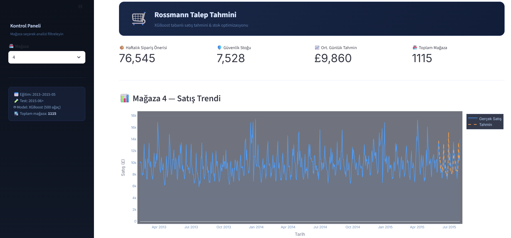
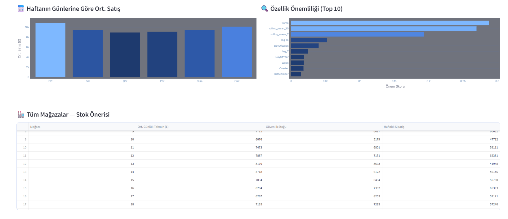
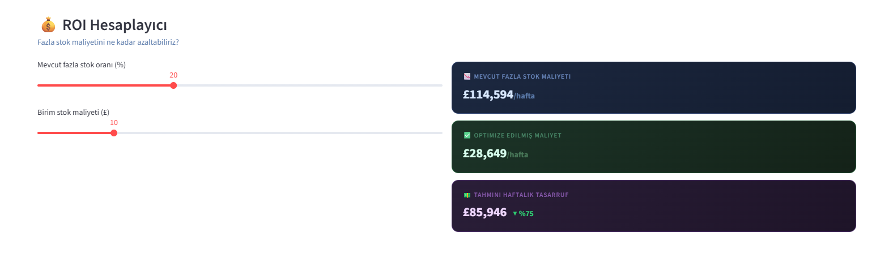

# 🛒 Rossmann Demand Forecasting & Inventory Optimization

End-to-end talep tahmini ve stok optimizasyonu pipeline'ı. 1115 mağaza, 1 milyonun üzerinde satış işlemi.

## 📸 Dashboard





## 🎯 Proje Özeti

Rossmann eczane zincirinin geçmiş satış verilerinden yola çıkarak:
- Gelecek talebi tahmin eden ML modeli kuruldu
- Mağaza bazında otomatik stok sipariş önerisi üretildi
- Tüm analizler interaktif bir dashboard'a taşındı

## 📊 Sonuçlar

| Model | MAE | RMSE | MAPE |
|-------|-----|------|------|
| XGBoost | 725£ | 1015£ | %11.1 |
| Prophet | 688£ | 832£ | %16.1 |

**XGBoost** tüm 1115 mağazada %11 hata payıyla çalışıyor.  
Stok optimizasyonu ile tahmini **haftalık £85.000+ tasarruf** potansiyeli.

## 🏗️ Pipeline Mimarisi

Ham CSV (1M+ satır)
↓
SQL Pipeline (temizleme + dönüştürme)
↓
Feature Engineering (lag, rolling mean, tarih özellikleri)
↓
Model Eğitimi (XGBoost + Prophet karşılaştırması)
↓
Inventory Optimization (güvenlik stoğu + sipariş önerisi)
↓
Streamlit Dashboard (interaktif görselleştirme + ROI hesaplayıcı)

## 🛠️ Teknolojiler

- **Veri:** Python, Pandas, SQLite, SQL
- **Modelleme:** XGBoost, Prophet, Scikit-learn
- **Görselleştirme:** Plotly, Matplotlib, Seaborn
- **Dashboard:** Streamlit

## 📁 Proje Yapısı

rossmann-demand-forecast/
├── data/
│   ├── raw/              ← Kaggle'dan indirilen ham CSV'ler
│   └── processed/        ← SQL ile işlenmiş veritabanı
├── sql/
│   ├── 01_create_tables.sql
│   ├── 02_clean_transform.sql
│   └── 03_feature_queries.sql
├── notebooks/
│   ├── 01_EDA.ipynb
│   ├── 02_feature_engineering.ipynb
│   ├── 03_modeling.ipynb
│   └── 04_inventory.ipynb
├── src/
│   └── data_loader.py
├── dashboard/
│   └── app.py
└── requirements.txt

## 🚀 Kurulum

```bash
git clone https://github.com/beriloztan/rossmann-demand-forecast
cd rossmann-demand-forecast
python -m venv venv
venv\Scripts\activate
pip install -r requirements.txt
```

Kaggle'dan [Rossmann Store Sales](https://www.kaggle.com/competitions/rossmann-store-sales/data) verisini indirip `data/raw/` klasörüne koy.

```bash
python src/data_loader.py
streamlit run dashboard/app.py
```

## 📈 Temel Bulgular

- **Promosyon** en güçlü satış belirleyicisi (feature importance: 0.29)
- **Aralık ayı** satışlar %25 artıyor — Noel etkisi
- **Mağaza tipi B** diğerlerine göre %48 daha yüksek satış yapıyor
- **Rakip mesafesi** satışı neredeyse hiç etkilemiyor (korelasyon: 0.00)

## 📂 Veri

[Rossmann Store Sales — Kaggle](https://www.kaggle.com/competitions/rossmann-store-sales)
- 1.017.209 satış kaydı
- 1115 mağaza
- 2013-2015 yılları arası günlük satış verisi